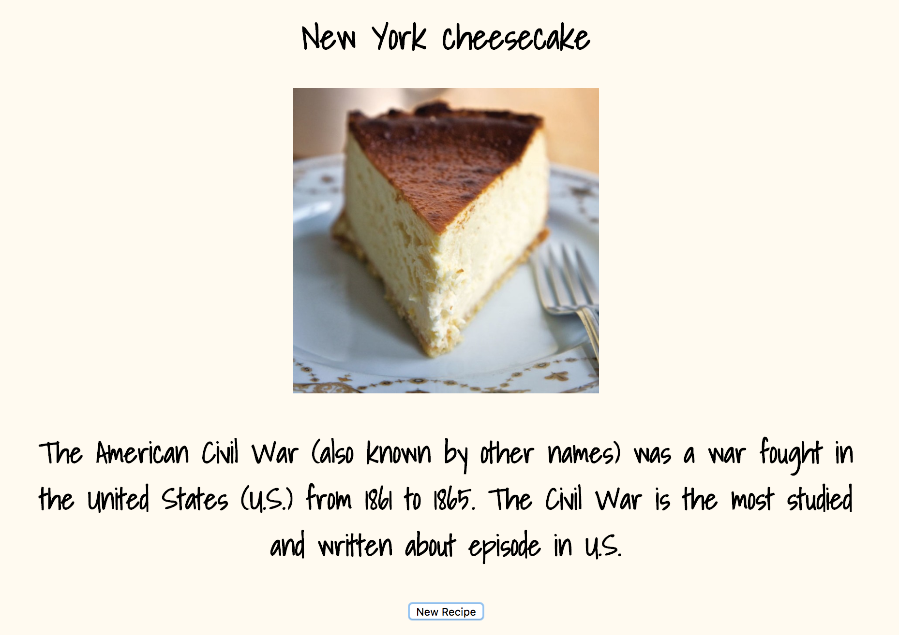

# New Recipe + New Fact
Get a new recipe suggestion and learn a new fact.

**Link to project:** https://friendly-snyder-f7f591.netlify.com/

## How It's Made:

**Tech used:** HTML5, CSS3, JavaScript, Meal and Wikipedia APIs.

This project was written in JavaScript using the fetch method to access the Meals Database. When a user clicks 'new recipe', the API returns the name and photo of a new recipe to try. The category this meal is classified under is then passed through the Wikipedia API to search. This returns a fact about the food category to the user. This project was designed using CSS3.

## Lessons Learned:

This project furthered my understanding of complex API structures.

## Related Projects:
Take a look at these projects that I have in my portfolio:

**NASA Photo API:** https://gallant-pasteur-e1c256.netlify.com/

**Artist Info API:** https://zen-bose-c1b511.netlify.com/

**Pokemon API:** https://admiring-cray-e04cdb.netlify.com/
